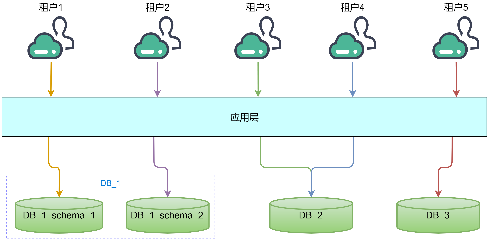
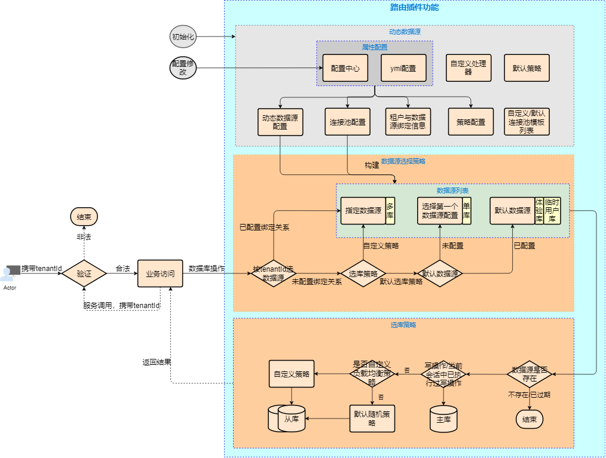

# saas-tenant-router-starter

***应用技术***：`mybatis` `springAop` `feign` `hystrix` `druid`  `hikari`

## 背景

支持多种存储类型组件动态路由，如RDS、*Redis、MQ、ES（规划中）*等; 支持不同存储组件动态加载，即根据后端资源动态开启或者关闭; 支持租户访问零信任安全策略，对访问请求多重校验。
## 概览图



## 原理图




## 租户信息传递

### Filter过滤器

默认使用TenantDomainInterceptor从request的header中获取租户标识，当使用其他方式传递租户标识时，可以参考TenantContext中HystrixRequestVariableDefault的使用，用于存储租户标识，并在跨服务请求时传递租户标识，在会话结束时需要主动移除。

### HystrixRequestVariableDefault

HystrixRequestVariableDefault用于保存一个会话级别的共享变量，需要在父线程中执行HystrixRequestContext.initializeContext()，实现与子线程共享。

## 配置结构

```yaml
spring:
  datasource:
    dynamic:
      enable: true # 开关
      effective-pool-name: hikari # 全局指定使用的连接池名称
      default-source: multitenant1 # 默认的数据源组名称
      pools: # 全局连接池配置，可配置等多种连接池
        druid: # 连接池名称，与相关池策略中PoolStrategy.getPoolName()对应
          name: globalDruidConfig
          initial-size: 10
          max-active: 20
          min-idle: 30
        hikari: # 连接池名称，与相关池策略中PoolStrategy.getPoolName()对应
          name: globalHikariConfig
      data-source-map:
        multitenant1: # 数据源组名，其下包含一主多从库配置
          load-balance-strategy: random # 指定负载均衡策略
          effective-pool-name: druid # 组指定使用的连接池名称
          modify-enable: false # 是否允许动态重建数据源，默认关闭
          enable: true # 是否生效，默认为true
          schema-isolation-enable: true # 是否开启schema隔离，默认为false
          pools: # 组内连接池配置，可配置等多种连接池，未配置的属性使用全局配置覆盖
            druid:
              name: dataGroup
              initial-size: 2
              max-active: 3
              min-idle: 1
            hikari:
              max-Pool-size: 100
          master: # 主库，目前支持单主模式
            url: jdbc:mysql://1.1.1.1:3306/housekeeping?useUnicode=true&characterEncoding=utf-8
            effective-pool-name: druid # 库指定使用的连接池名称
            username: xxx
            password: xxx
            driver-class-name: com.mysql.cj.jdbc.Driver
            pools: # 库级别连接池配置，未配置的使用组级别配置覆盖，组级别未配置的使用全局配置覆盖
              druid:
                name: master
          slave: # 从库，目前支持多从模式
            - url: jdbc:mysql://1.1.1.2:3306/housekeeping?useUnicode=true&characterEncoding=utf-8
            		 # 未配置的数据库连接属性，如用户名，密码，driver，未配置时，使用同组内主库配置
              pools: # 库级别连接池配置，未配置的使用组级别配置覆盖，组级别未配置的使用全局配置覆盖
                druid:
                  name: slave
            - url: jdbc:mysql://1.1.1.2:3306/housekeeping?useUnicode=true&characterEncoding=utf-8
              active-pool-name: c3p0 # 库级别，指定连接池类型，选择路径pools下的连接池名，与相关池策略中PoolStrategy.getPoolName()对应 
              pools:
                druid:
                  name: slave
      binding-map: # 租户绑定信息
        0bc92b8e542a4ba9ab35b1de8b1794eb: # 租户标识
          schema: tenant_0bc92b8e542a4ba9ab35b1de8b1794eb # 指定租户绑定schema, 未配置则采用SchemaAdapter所使用策略，未自行扩展时，使用DefaultSchemaAdapter默认选取
          group-name: multitenant1 # 指定数据源组名，选择 data-source-map 配置的组,未指定时，采用DataSourceAdapter所使用策略，未自行扩展时，使用DefaultDataSourceAdapter默认选取
```

## 如何使用

### 1.装配路由插件

```
目前暂时未发布稳定版本，暂时需要下载源码包使用，发布稳定版本后更新依赖。
```

### 2.开启插件

```yaml
spring:
  datasource:
    dynamic:
      enable: true #开关
```

### 3.配置数据源组

```yaml
spring:
  datasource:
    dynamic:
      enable: true #开关
      data-source-map:
        multitenant1: #数据源组名，其下包含一主多从库配置
          modify-enable: false # 是否允许动态重建数据源，默认关闭
          enable: true # 是否生效，默认为true
          schema-isolation-enable: true # 是否开启schema隔离，默认为false
          master: # 主库，目前支持单主模式
            url: jdbc:mysql://1.1.1.1:3306/housekeeping?useUnicode=true&characterEncoding=utf-8
            username: xxx
            password: xxx
            driver-class-name: com.mysql.cj.jdbc.Driver
          slave: # 从库，目前支持多从模式
            - url: jdbc:mysql://1.1.1.2:3306/housekeeping?useUnicode=true&characterEncoding=utf-8
            		 # 未配置的数据库连接属性，如用户名，密码，driver，未配置时，使用同组内主库配置
            - url: jdbc:mysql://1.1.1.3:3306/housekeeping?useUnicode=true&characterEncoding=utf-8
```

需要在data-source-map路径之下配置数据源组，key=数据源组名称， 此名称不可重复。数据源组内可配置一主多从，主库路径为master，从库路径为slave，可配多个从库。主库或者从库可配置数据库连接信息如连接地址url，用户名username，密码password，驱动driver-class-name。当从库未配置username，password，driver-class-name时，会默认使用同组中主库的对应配置。url必须配置，为防止误配，此项未作为缺省配置。

spring.datasource.dynamic.data-source-map.*.enable 数据源是否生效开关

spring.datasource.dynamic.data-source-map.*.modify-enable 是否允许动态重建数据源开关，默认false关闭，当开启时，可以通过修改属性并出发refresh事件（参考spring-cloud-config）达到使用最新配置重建当前数据源组的目的

spring.datasource.dynamic.data-source-map.*.schema-isolation-enable 数据源组是否开始schema隔离，默认为false关闭，当开启时，必须为绑定此数据源组的租户绑定一个有效的schema，否则路由失败；关闭时，忽略绑定的schema，默认路由到默认schema


### 4.配置连接池

```yaml
spring:
  datasource:
    dynamic:
      pools: # 全局连接池配置，可配置等多种连接池
        druid: # 连接池名称，与相关池策略中PoolStrategy.getPoolName()对应
          name: globalDruidConfig
          initial-size: 10
          max-active: 20
          min-idle: 30
        hikari: # 连接池名称，与相关池策略中PoolStrategy.getPoolName()对应
          name: globalHikariConfig
      data-source-map:
        multitenant1: #数据源组名，其下包含一主多从库配置
          pools: # 组内连接池配置，可配置等多种连接池，未配置的属性使用全局配置覆盖
            druid:
              name: dataGroup
              initial-size: 2
              max-active: 3
              min-idle: 1
          master: # 主库，目前支持单主模式
            pools: # 库级别连接池配置，未配置的使用组级别配置覆盖，组级别未配置的使用全局配置覆盖
              druid:
                name: master
          slave: # 从库，目前支持多从模式
            - url: jdbc:mysql://1.1.1.2:3306/housekeeping?useUnicode=true&characterEncoding=utf-8
            		 # 未配置的数据库连接属性，如用户名，密码，driver，未配置时，使用同组内主库配置
              pools: # 库级别连接池配置，未配置的使用组级别配置覆盖，组级别未配置的使用全局配置覆盖
                druid:
                  name: slave
```

在配置的多个层级中都支持配置连接池属性，配置路径如下：

路径spring.datasource.dynamic.pools下的连接池配置为全局配置，会被更细粒度的配置覆盖。

路径spring.datasource.dynamic.data-source-map.*.pools下的配置为数据源组级别的配置，路径中的 * 代表数据源组名称, 需要使用全小写, 名称中 - 将不会转换为首字母大写。

路径spring.datasource.dynamic.data-source-map.*.master.pools下的配置为主库级别的配置

路径spring.datasource.dynamic.data-source-map.*.slave.pools下的配置为从库级别的配置

当主库或者从库有属性未配置时，此属性将会使用其所属数据源组的同名称的连接池的配置，所属数据源组仍未配置时，此属性继续向上使用全局连接池配置，仍未找到，则为空。

pools之下配置的key为连接池名称，或可以称为类型，从下至上配置的属性进行覆盖时，按照连接池名称查找。连接池名称对应代码中PoolStrategy.getPoolName()获取的值。目前已实现druid，hikari连接池，每一个连接池类型需要新增两个java类，用于承载池属性配置和创建连接池，均属于PoolStrategy的子类。

连接池属性类，用于承载连接池属性的类需要实现 JdbcPool接口，此接口继承PoolStrategy。

连接池创建类，用于实现数据源创建功能的类需要实现DataSourceCreator接口，此接口继承PoolStrategy。目前已有druid，hikari的实现，可参考。

如果有需要扩展自定义连接池，需要做到三点：1.新增连接池属性类，需实现JdbcPool接口。2.新增数据源创建类实现DataSourceCreator接口。3.以上两个实现的getPoolName() 返回的值将会当做池名称，读取*.*..pools之下的相匹配的key所对应的配置信息。

主库和从库之间的连接池配置相互独立。

### 5.指定连接池

```yaml
spring:
  datasource:
    dynamic:
      enable: true #开关
      effective-pool-name: druid # 全局指定使用的连接池名称
      data-source-map:
        multitenant1: #数据源组名，其下包含一主多从库配置
          effective-pool-name: druid # 组指定使用的连接池名称
          master: # 主库，目前支持单主模式
            url: jdbc:mysql://1.1.1.1:3306/housekeeping?useUnicode=true&characterEncoding=utf-8
            active-pool-name: druid # 库指定使用的连接池名称
          slave: # 从库，目前支持多从模式
            - url: jdbc:mysql://1.1.1.2:3306/housekeeping?useUnicode=true&characterEncoding=utf-8
              active-pool-name: c3p0 # 库级别，指定连接池类型，选择路径pools下的连接池名，与相关池策略中PoolStrategy.getPoolName()对应 
```

指定连接池的属性与连接池配置类似，

spring.datasource.dynamic.active-pool-name 为全局配置

spring.datasource.dynamic.data-source-map.*.effective-pool-name 为数据源组级别配置

spring.datasource.dynamic.data-source-map.*.master.effective-pool-name 为主库配置

spring.datasource.dynamic.data-source-map.*.slave.effective-pool-name 为从库配置

当主库或者从库未配置时，使用所属数据源组的组级别配置，组未配置时，使用全局配置，如果全局配置仍未配置，则默认使用hikari连接池。

### 6.指定负载均衡策略

```
spring:
  datasource:
    dynamic:
      data-source-map:
        multitenant1: #数据源组名，其下包含一主多从库配置
          load-balance-strategy: random # 指定负载均衡策略
```

负载均衡策略配置路径spring.datasource.dynamic.data-source-map.*.load-balance-strategy，各组单独配置，如未配置，则默认使用随机算法进行负载均衡。

目前只实现了随机算法，如有需要扩展，可以实现LoadBalanceStrategy接口扩展，算法类型为LoadBalanceStrategy.getStrategyType()，如果使用扩展算法，必须在配置中显示指定算法类型，否则使用随机算法。

### 7.租户绑定数据源

```yaml
spring:
  datasource:
    dynamic:
      default-source: multiTenant1 # 默认的数据源组名称
      binding-map: # 租户绑定信息
        0bc92b8e542a4ba9ab35b1de8b1794eb: # 租户标识
          group-name: multitenant1 # 指定数据源组名，选择 data-source-map 配置的组,未指定时，采用DataSourceAdapter所使用策略，未自行扩展时，使用DefaultDataSourceAdapter默认选取
```

绑定路径为spring.datasource.dynamic.binding-map.*.group-name 指定数据源组名称， * 为租户标识。DataSourceBindingStrategy的扩展实现来获取绑定的数据源，如果未添加自定义扩展，将会采用默认的数据源策略DefaultDataSourceBindingStrategy获取数据源，获取逻辑为优先使用spring.datasource.dynamic.default-source 指定的数据源组，如果default-source未配置，则判断已配置的数据源组列表中是否只有一组数据源，是则选择这一个组作为数据源使用，否则获取的数据源为空，选择数据源失败。

### 8.租户绑定schema

```yaml
spring:
  datasource:
    dynamic:
      enable: true #开关
      binding-map: # 租户绑定信息
        0bc92b8e542a4ba9ab35b1de8b1794eb: # 租户标识
          schema: tenant_0bc92b8e542a4ba9ab35b1de8b1794eb # 指定租户绑定schema, 未配置则采用SchemaAdapter所使用策略，未自行扩展时，使用DefaultSchemaAdapter默认选取
```

此配置仅针对使用schema隔离的场景使用，绑定路径为spring.datasource.dynamic.binding-map.*.schema 指定的schema， *为租户标识，当某个租户标识未在此绑定schema时，将会使用SchemaBindingStrategy的扩展实现来获取租户对应的schema，如果未自定义扩展，则使用DefaultSchemaBindingStrategy来获取schema。

自定义扩展中，可以使用按既定规则拼接，数据库表存储，缓存或者其他任意方式根据租户标识获取。

### 9.数据源动态变更

在不重启服务前提下，通过配置中心修改spring.datasource.dynamic之下的数据库连接属性或者连接池属性配置，可以根据最新的配置重建，新增，关闭数据源。此功能默认是处于关闭状态，当某个数据源组需要开启支持动态变更时，需要配置属性spring.datasource.dynamic.data-source-map.*.modify-enable=true，当修改连接池属性后，需要重建连接池时，需要实现PoolRefreshProcessor接口，用于确定修改哪些参数需要触发重建，修改之后需要触发RefreshScopeRefreshedEvent事件，用于触发变更（使用spring-cloud-config作为配置中心时，调用/actuator/busrefresh即可，其他未使用spring事件机制的配置中心，需要添加事件触发机制）。连接池属性与数据库连接属性之外的其他配置，修改立即生效。

变更支持的场景如下：

1.新增数据源组	

2.关闭数据源组，需配置spring.datasource.dynamic.data-source-map.*.enable=false	

3.组被新增slave	

4.组被修改数据库连接属性或者连接池属性	

5.组内关闭slave，需配置spring.datasource.dynamic.data-source-map.*.salve.0.enable=false	

6.组内删除配置也可以关闭对应库的连接池	

当使用此项功能时，请关注对应的日志，确定数据源的变更结果。

### 10.事务

目前仅支持基于注解@Transactional的声明式事务，当使用事务时，数据源切换为master主库。

